# Report for chapter2
## 实验内容
1. 安装并使用asciinema并在至少两个linux发行版上完成实验
2. tmux和tshark的安装与卸载
3. 文件管理 
4. 文件压缩与解压缩
5. 子进程管理
6. 硬件信息获取
## 实验环境
实验要求在两种不同的发行版下完成实验，分别选用Ubuntu 20.04 Server与 阿里云提供的CentOS。

详细信息分别为：

    $ lsb_release -a
    Distributor ID: Ubuntu
    Description:    Ubuntu 20.04.2 LTS
    Release:        20.04
    Codename:       focal

    # lsb_release -a
    LSB Version:    :core-4.1-amd64:core-4.1-noarch
    Distributor ID: CentOS
    Description:    CentOS Linux release 7.7.1908   (Core)
    Release:        7.7.1908
    Codename:       Core

## 实验过程
### 安装并配置asciinema
登录官网并使用邮箱进行注册
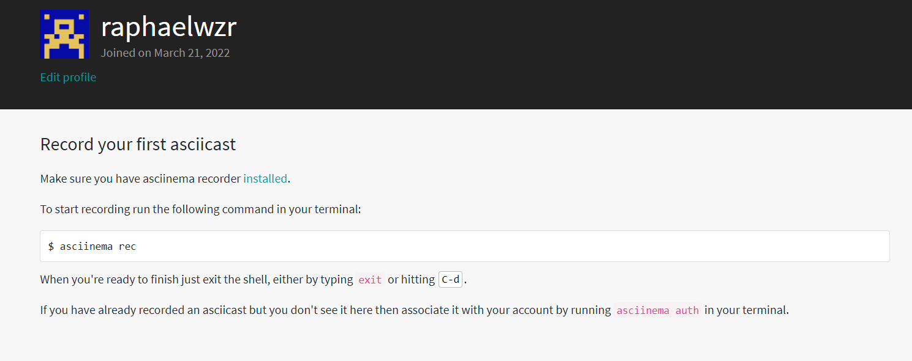
Ubuntu 安装：

完整注册后进行安装，一开始选用其说明中Ubuntu下的安装方式

    sudo apt-add-repository ppa:zanchey/asciinema
    sudo apt-get update
    sudo apt-get install asciinema

但出现了如下错误
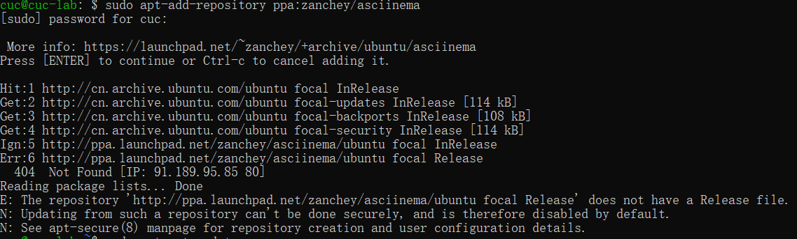

排错未果，发现可以通过pip安装

    sudo pip3 install asciinema

CentOS安装：

    yum install asciinema

安装成功！之后进行授权操作，则我们录制的结果可以自动上传到账户中。
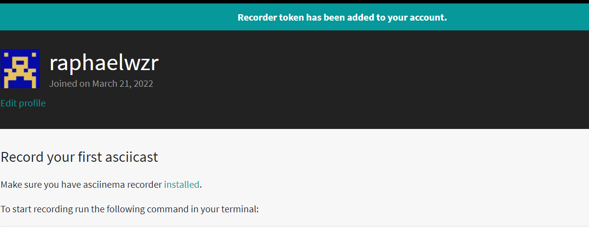

### 软件包管理
用以下命令进行相关软件包的下载，查找及删除

    sudo apt install tmux tsahrk        #安装

    whereis tmux                        #查找
    whereis tshark

    sudo apt-get remove --purge tshark  # 卸载

需要注意的是Centos下，tshark包名为wireshark.

之后输入`tshark`或`wireshark`发现命令找不到，说明卸载成功。

> Command 'tshark' not found, but can be installed with:
>
> sudo apt install tshark

两个发行版本下的操作录制如下：

|Ubuntu |CentOS|
|---|---|
|[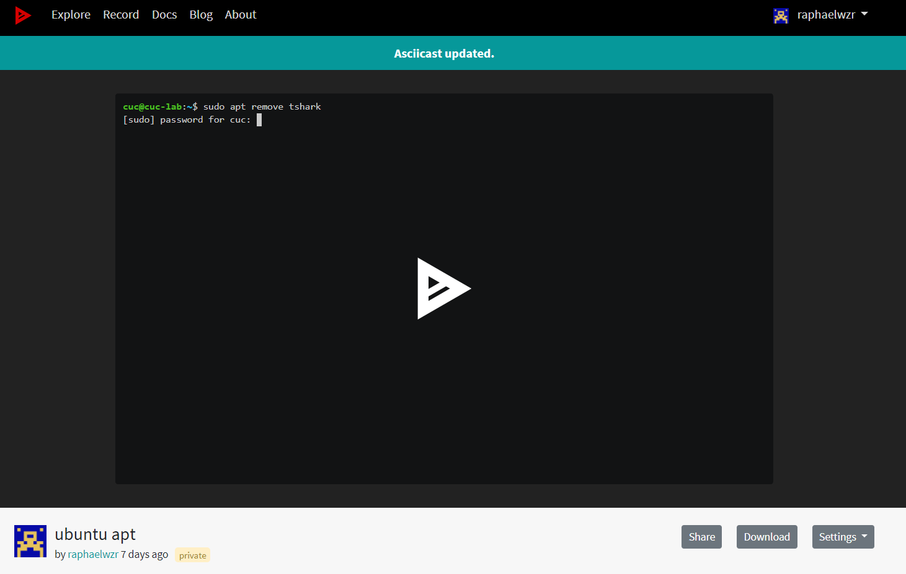](https://asciinema.org/a/vjjq3FAVqDbkTzR2QtETkhMRn)|[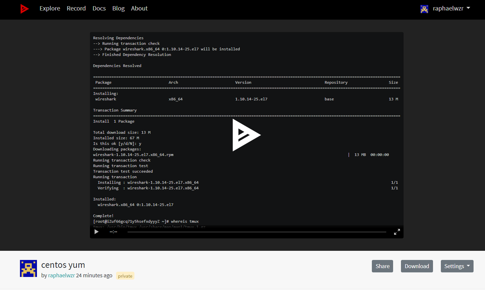](https://asciinema.org/a/0PzUizEusQUNZ2z3cJXGN1yid)

### 文件管理

首先使用如下命令构建测试数据集：

    cd /tmp && for i in $(seq 0 1024);do dir="test-$RANDOM";mkdir "$dir";echo "$RANDOM" > "$dir/$dir-$RANDOM";done

寻找文件名包含`666` 的所有文件命令为：

    sudo find /tmp/ -type f -name "*666*"

文件内容包含 `666` 的所有文件命令为：

    sudo grep -r "666" /tmp/

两个发行版本下的操作录制如下：
|Ubuntu |CentOS|
|---|---|
|[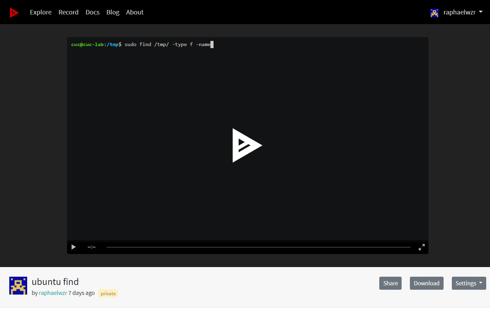](https://asciinema.org/a/XGRUJRcnrQtH99HcOzor7MgQS)|[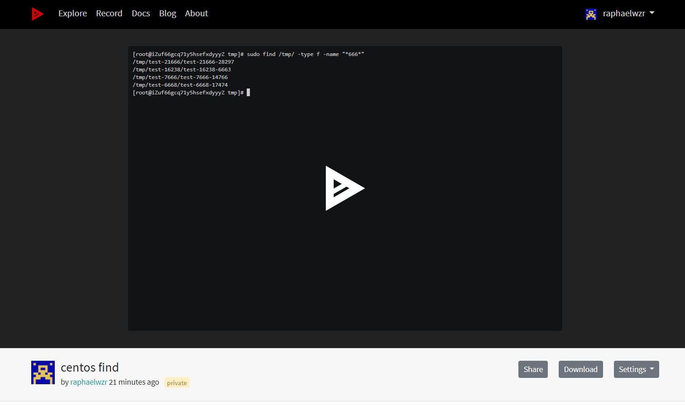](https://asciinema.org/a/aKZeyzNnjQF2kw4x7PvCuehoB)

### 解压缩
首先我们使用zip命令压缩第一次实验生成的文件LtoS.txt，可以看到生成了一个新的压缩包。再使用unzip命令进行解压缩，看到该文件被重新解压出来。

两个发行版本下操作相同，使用命令为

    #压缩LtoS.txt到myzip.zip
    sudo zip -q myzip.zip /home/cuc/LtoS.txt

    #解压myzip.zip到当前目录
    sudo unzip myzip.zip

需要注意的是，CentOS需要先安装unzip，命令为

    yum install -y unzip zip

两个发行版本下的操作录制如下：
|Ubuntu |CentOS|
|---|---|
|[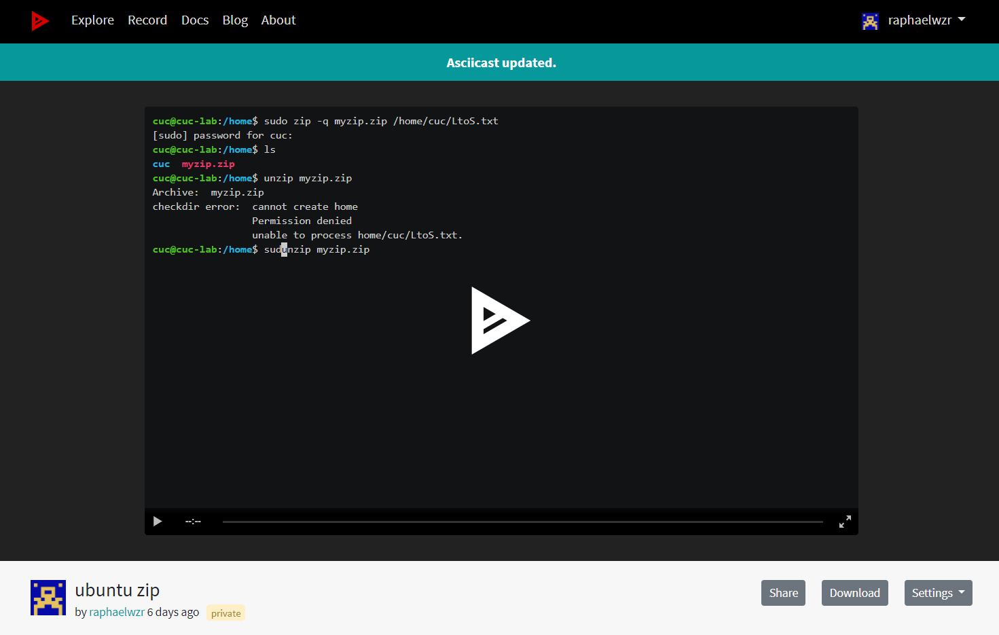](https://asciinema.org/a/zW2Pa7RhRkM6hh5etb103ko81)|[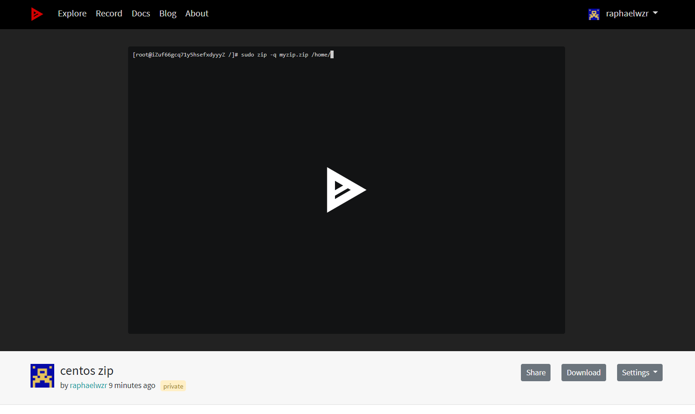](https://asciinema.org/a/hOb2iAXj7yRsv0lBoOHRp1hTu)
### 查看硬件信息

获取硬件信息可采用如下命令：

    lscpu               #查看cpu统计信息
    cat /proc/cpuinfo   # 获取每个CPU的信息

    free -h             #查看内存概况
    cat /proc/meminfo   #获取每个内存的信息

    lsblk               #查看硬盘和分区分布
    fdisk -l            #查看硬盘和分区的详细信息

两个发行版本下的操作录制如下：
|Ubuntu |CentOS|
|---|---|
|[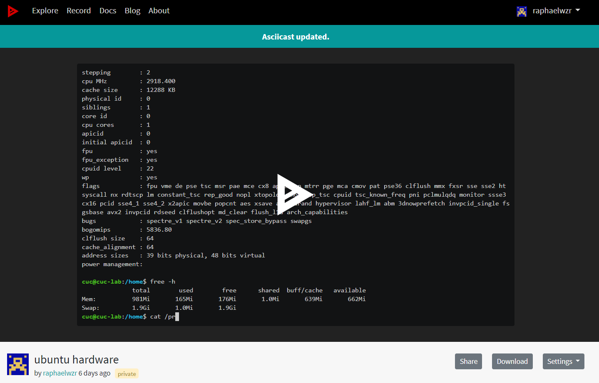](https://asciinema.org/a/Rikp6Y9ZHbMjuRbsX3bi5E1HD)|[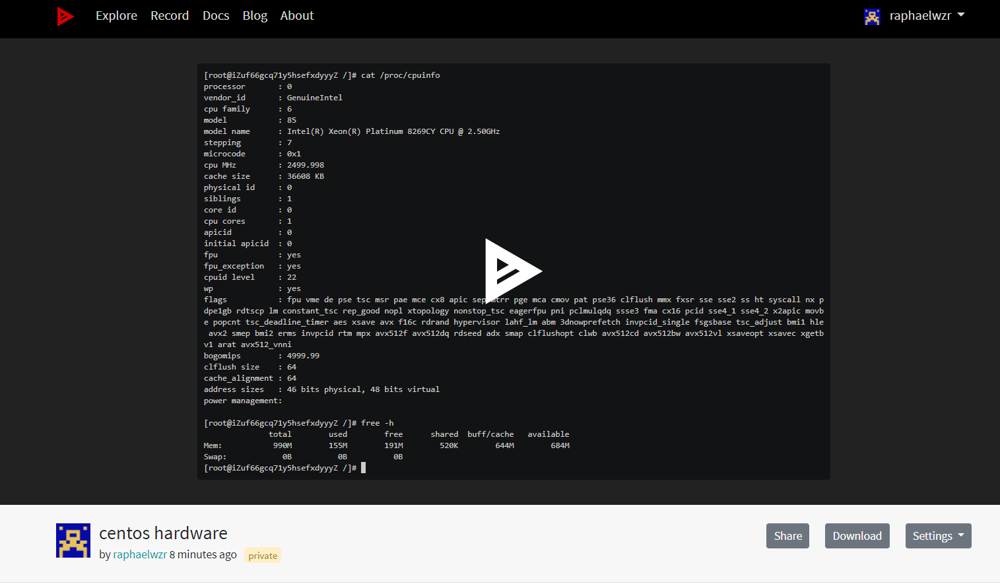](https://asciinema.org/a/JUo6wV2SwmiVDW9OmBnvNYSL7)

# 作业小结
本次作业遇到的主要问题有：
1. 设置asciinema时有一些波折，后经过查看同学们讨论区的帖子解决
2. 想要本地安装一个kali linux子系统完成实验但是受阻，导致了作业未能按时提交。后来还是改用阿里云云起实验室。

本次作业的不足之处有：
1. 未能充分探索出Ubuntu和CentOS的不同之处
2. 由于时间安排原因未能按时提交，掐点在一周之内补交。以后争取不再出现这种情况。