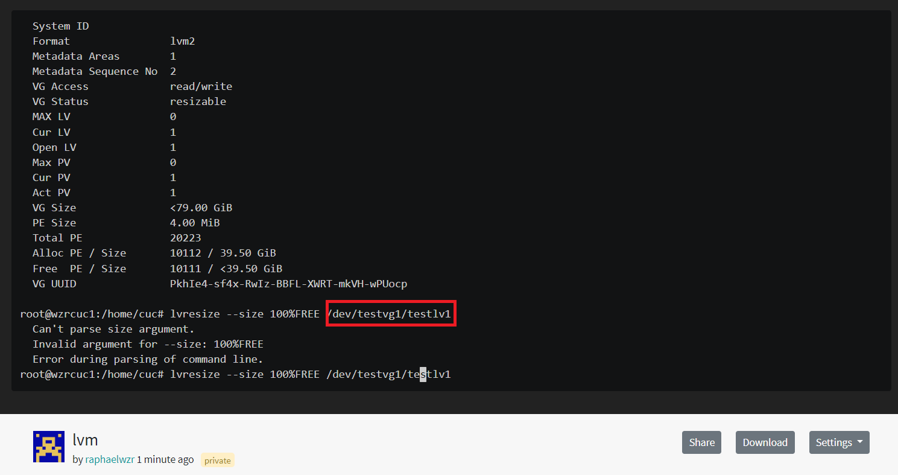

# Report for chapter3

## 实验任务

1. [Systemd 入门教程：命令篇](http://www.ruanyifeng.com/blog/2016/03/systemd-tutorial-commands.html)

2. [Systemd 入门教程：实战篇](http://www.ruanyifeng.com/blog/2016/03/systemd-tutorial-part-two.html)

3. 自查清单
    - 如何添加一个用户并使其具备sudo执行程序的权限？
    - 如何将一个用户添加到一个用户组？
    - 如何查看当前系统的分区表和文件系统详细信息？
    - 如何实现开机自动挂载VMware Workstation的共享目录分区？
    - 基于LVM（逻辑分卷管理）的分区如何实现动态扩容和缩减容量？
    - 如何通过systemd设置实现在网络连通时运行一个指定脚本，在网络断开时运行另一个脚本？
    - 如何通过systemd设置实现一个脚本在任何情况下被杀死之后会立即重新启动？实现**杀不死**？

## 实验环境
本次没有要求在不同环境下操作，因此选用Ubuntu 20.04 server一种即可。

## 系统管理
0. ### Systemd 概述
Systemd 就是为了解决init启动进程的相关问题而诞生的。它的设计目标是，为系统的启动和管理提供一套完整的解决方案。

可以通过`$ systemctl --version`命令来查看 Systemd 的版本。结果为

```bash
systemd 245 (245.4-4ubuntu3.4)
+PAM +AUDIT +SELINUX +IMA +APPARMOR +SMACK +SYSVINIT +UTMP +LIBCRYPTSETUP +GCRYPT +GNUTLS +ACL +XZ +LZ4 +SECCOMP +BLKID +ELFUTILS +KMOD +IDN2 -IDN +PCRE2 default-hierarchy=hybrid
```

1. ### **systemctl**

    `systemctl`是Systemd的主命令，用于系统管理。

    ```bash
    # 重启系统
    $ sudo systemctl reboot
    
    # 关闭系统，切断电源
    $ sudo systemctl poweroff
    
    # CPU停止工作
    $ sudo systemctl halt
    
    # 暂停系统
    $ sudo systemctl suspend
    
    # 让系统进入冬眠状态
    $ sudo systemctl hibernate
    
    # 让系统进入交互式休眠状态
    $ sudo systemctl hybrid-sleep
    
    # 启动进入救援状态（单用户状态）
    $ sudo systemctl rescue
    ```

    这部分很难记录下来操作，未予录像。

2. **systemd-analyze**

    `systemd-analyze`命令用于查看启动耗时。

    ```bash
    # 查看启动耗时
    $ systemd-analyze                                                            
    # 查看每个服务的启动耗时
    $ systemd-analyze blame
    
    # 显示瀑布状的启动过程流
    $ systemd-analyze critical-chain
    
    # 显示指定服务的启动流
    $ systemd-analyze critical-chain atd.service
    ```
    

3. **hostnamectl**

    `hostnamectl`命令用于查看当前主机的信息。 

    ```bash
    # 显示当前主机的信息
    $ hostnamectl
    
    # 设置主机名。
    $ sudo hostnamectl set-hostname cuc
    ```
4. **localectl**

    `localectl`命令用于查看本地化设置。 
    ```bash
    # 查看本地化设置
    $ localectl
    
    # 设置本地化参数。
    $ sudo localectl set-locale LANG=en_GB.utf8
    $ sudo localectl set-keymap en_GB
    ```

5. **timedatectl**

    `timedatectl`命令用于查看当前时区设置。 

    ```bash
    # 查看当前时区设置
    $ timedatectl
    
    # 显示所有可用的时区
    $timedatectllist-timezones                                                                                 
    # 设置当前时区
    $ sudo timedatectl set-timezone America/New_York
    $ sudo timedatectl set-time YYYY-MM-DD
    $ sudo timedatectl set-time HH:MM:SS
    ```


6. **loginctl**

    `loginctl`命令用于查看当前登录的用户。 

    ```bash
    # 列出当前session
    $ loginctl list-sessions
    
    # 列出当前登录用户
    $ loginctl list-users
    
    # 列出显示指定用户的信息
    $ loginctl show-user deng
    ```

7. ### 该节录像

    [](https://asciinema.org/a/aam3RxoVxPARYlGbSKjIWxaqm)

## Unit
0. ### unit概述
    Systemd 可以管理所有系统资源。不同的资源统称为 Unit。一共分成12种：
    ```text
    Service unit：系统服务
    Target unit：多个 Unit 构成的一个组
    Device Unit：硬件设备
    Mount Unit：文件系统的挂载点
    Automount Unit：自动挂载点
    Path Unit：文件或路径
    Scope Unit：不是由 Systemd 启动的外部进程
    Slice Unit：进程组
    Snapshot Unit：Systemd 快照，可以切回某个快照
    Socket Unit：进程间通信的 socket
    Swap Unit：swap 文件
    Timer Unit：定时器
    ```

    `systemctl list-units`命令可以查看查看当前系统的所有 Unit 。

    ```bash
    # 列出正在运行的 Unit
    $ systemctl list-units

    # 列出所有Unit，包括没有找到配置文件的或者启动失败的
    $ systemctl list-units --all

    # 列出所有没有运行的 Unit
    $ systemctl list-units --all --state=inactive

    # 列出所有加载失败的 Unit
    $ systemctl list-units --failed

    # 列出所有正在运行的、类型为 service 的 Unit
    $ systemctl list-units --type=service
    ```
1. ### Unit 的状态
    `systemctl status`命令用于查看系统状态和单个 Unit 的状态。
    ```bash
    # 显示系统状态
    $ systemctl status

    # 显示单个 Unit 的状态
    $ sysystemctl status bluetooth.service

    # 显示远程主机的某个 Unit 的状态
    $ systemctl -H root@rhel7.example.com status httpd.service

    # 显示某个 Unit 是否正在运行
    $ systemctl is-active apache2.service

    # 显示某个 Unit 是否处于启动失败状态
    $ systemctl is-failed apache2.service

    # 显示某个 Unit 服务是否建立了启动链接
    $ systemctl is-enabled apache2.service

2. ### Unit 管理
    下面这些命令，用于启动和停止 Unit:
    ``` bash
    # 立即启动一个服务
    $ sudo systemctl start apache2.service

    # 立即停止一个服务
    $ sudo systemctl stop apache2.service

    # 重启一个服务
    $ sudo systemctl restart apache2.service

    # 杀死一个服务的所有子进程
    $ sudo systemctl kill apache2.service

    # 重新加载一个服务的配置文件
    $ sudo systemctl reload apache2.service

    # 重载所有修改过的配置文件
    $ sudo systemctl daemon-reload

    # 显示某个 Unit 的所有底层参数
    $ systemctl show apache2.service

    # 显示某个 Unit 的指定属性的值
    $ systemctl show -p CPUShares apache2.service

    # 设置某个 Unit 的指定属性
    $ sudo systemctl set-property apache2.service CPUShares=500
    ```

3. ### 依赖关系

    Unit 之间存在依赖关系：A 依赖于 B，就意味着 Systemd 在启动 A 的时候，同时会去启动 B。
    ```bash
    # `systemctl list-dependencies`命令列出一个 Unit 的所有依赖。
    $ systemctl list-dependencies nginx.service

    # 展开target，就需要使用--all参数。
    $ systemctl list-dependencies --all nginx.service
    ```
4. ### 该节录像
    [](https://asciinema.org/a/0anxoNk6aHD3111deAmqPLenZ)


## Unit 的配置文件

1. ### 概述
    `Systemd` 默认从目录`/etc/systemd/system/`读取配置文件。但是，里面存放的大部分文件都是符号链接，指向目录`/usr/lib/systemd/system/`，真正的配置文件存放在那个目录。

    `systemctl enable`命令用于在上面两个目录之间，建立符号链接关系。

    `systemctl disable`命令用于在两个目录之间，撤销符号链接关系，相当于撤销开机启动。

2. ### 配置文件

    ``` bash
    # 列出所有配置文件
    $ systemctl list-unit-files

    # 列出指定类型的配置文件
    $ systemctl list-unit-files --type=service

    # 一旦修改配置文件，就要让 SystemD 重新加载配置文件，然后重新启动，否则修改不会生效。

    $ sudo systemctl daemon-reload
    $ sudo systemctl restart apache2.service
    ```

    $ systemctl cat atd.service

    `systemctl cat`命令可以查看配置文件的内容。

    ```bash   
    $ systemctl cat atd.service

    [Unit]
    Description=ATD daemon

    [Service]
    Type=forking
    ExecStart=/usr/bin/atd

    [Install]
    WantedBy=multi-user.target
    ```

3. ### 该节录像
[](https://asciinema.org/a/3YTkPBIKPRRorJ0wNyUF59fU3)

## Target

启动计算机的时候，需要启动大量的 `Unit`。如果每一次启动，都要一一写明本次启动需要哪些 `Unit`，显然非常不方便。`Systemd` 的解决方案就是 `Target`。

简单说，`Target` 就是一个 `Unit` 组，包含许多相关的 `Unit` 。启动某个 `Target` 的时候，`Systemd` 就会启动里面所有的 `Unit`。从这个意义上说，`Target` 这个概念类似于"状态点"，启动某个 `Target` 就好比启动到某种状态。

``` bash
# 查看当前系统的所有 Target
$ systemctl list-unit-files --type=target

# 查看一个 Target 包含的所有 Unit
$ systemctl list-dependencies multi-user.target

# 查看启动时的默认 Target
$ systemctl get-default

# 设置启动时的默认 Target
$ sudo systemctl set-default multi-user.target

# 切换 Target 时，默认不关闭前一个 Target 启动的进程，
# systemctl isolate 命令改变这种行为，
# 关闭前一个 Target 里面所有不属于后一个 Target 的进程
$ sudo systemctl isolate multi-user.target
```
实验录像：
[](https://asciinema.org/a/akt2zatyMAPDoZTSQuaIqBTY1)

## 日志管理
`Systemd` 统一管理所有 `Unit` 的启动日志。带来的好处就是，可以只用`journalctl`一个命令，查看所有日志（内核日志和应用日志）。日志的配置文件是`/etc/systemd/journald.conf`。
``` bash
# 查看所有日志（默认情况下 ，只保存本次启动的志）
$ sudo journalctl
# 查看内核日志（不显示应用日志）
$ sudo journalctl -k
# 查看系统本次启动的日志
$ sudo journalctl -b
$ sudo journalctl -b -0
# 查看上一次启动的日志（需更改设置）
$ sudo journalctl -b -1
# 查看指定时间的日志
$ sudo journalctl --since="2012-10-3018:17:16"
$ sudo journalctl --since "20 min ago"
$ sudo journalctl --since yesterday
$ sudo journalctl --since "2015-01-10"--until  "2015-01-11 03:00"
$ sudo journalctl --since 09:00 --until "1hour     ago"
# 显示尾部的最新10行日志
$ sudo journalctl -n
# 显示尾部指定行数的日志
$ sudo journalctl -n 20
# 实时滚动显示最新日志
$ sudo journalctl -f
# 查看指定服务的日志
$ sudo journalctl /usr/lib/systemd/systemd
# 查看指定进程的日志
$ sudo journalctl _PID=1
# 查看某个路径的脚本的日志
$ sudo journalctl /usr/bin/bash
# 查看指定用户的日志
$ sudo journalctl _UID=33 --since today
# 查看某个 Unit 的日志
$ sudo journalctl -u nginx.service
$ sudo journalctl -u nginx.service --sincetoday
# 实时滚动显示某个 Unit 的最新日志
$ sudo journalctl -u nginx.service -f
# 合并显示多个 Unit 的日志
$ journalctl -u nginx.service -u php-fpmservice    --since today
# 查看指定优先级（及其以上级别）的日志，共有8级
# 0: emerg
# 1: alert
# 2: crit
# 3: err
# 4: warning
# 5: notice
# 6: info
# 7: debug
$ sudo journalctl -p err -b
# 日志默认分页输出，--no-pager 改为正常的标准出
$ sudo journalctl --no-pager
# 以 JSON 格式（单行）输出
$ sudo journalctl -b -u nginx.service -o json
# 以 JSON 格式（多行）输出，可读性更好
$ sudo journalctl -b -u nginx.serviceqq
 -o json-pretty
# 显示日志占据的硬盘空间
$ sudo journalctl --disk-usage
# 指定日志文件占据的最大空间
$ sudo journalctl --vacuum-size=1G
# 指定日志文件保存多久
$ sudo journalctl --vacuum-time=1years
```
实验录像：
[](https://asciinema.org/a/SFLUuGJdIGejSrJhrXxNEf81p)


## 开机启动配置实战
1. 配置流程如下：（以apache2为例）
    ``` bash
    # 允许开机启动
    $ sudo systemctl enable apache2
    # 查看当前状态
    $ sudo systemctl status apache2
    # 停止该进程
    $ sudo systemctl stop apache2.service
    # 强制杀死进程
    $ sudo systemctl kill apache2.service
    # 重启进程
    $ sudo systemctl restart apache2.service
    # 查看配置文件
    $ systemctl cat apache2.service
    # 重新加载配置文件
    $ sudo systemctl daemon-reload
    # 重启相关服务asci
    $ sudo systemctl restart apache2
    ```
2. 配置文件说明

    1.  `Unit`区块
    >Description：简短描述
    >
    >Documentation：文档地址
    >
    >Requires：当前 Unit 依赖的其他 Unit，如果它们没有运行，当前 Unit 会启动失败
    >
    >Wants：与当前 Unit 配合的其他 Unit，如果它们没有运行，当前 Unit 不会启动失败
    >
    >BindsTo：与Requires类似，它指定的 Unit 如果退出，会导致当前 Unit 停止运行
    >
    >Before：如果该字段指定的 Unit 也要启动，那么必须在当前 Unit 之后启动
    >
    >After：如果该字段指定的 Unit 也要启动，那么必须在当前 Unit 之前启动
    >
    >Conflicts：这里指定的 Unit 不能与当前 Unit 同时运行
    >
    >Condition...：当前 Unit 运行必须满足的条件，否则不会运行
    >
    >Assert...：当前 Unit 运行必须满足的条件，否则会报启动失败

    2. `Install` 区块
    >WantedBy：它的值是一个或多个 Target，当前 Unit 激活时（enable）符号链接会放入/etc/systemd/system目录下面以 Target 名 + .wants后缀构成的子目录中
    >
    >RequiredBy：它的值是一个或多个 Target，当前 Unit 激活时，符号链接会放入/etc/systemd/    system目录下面以 Target 名 + .required后缀构成的子目录中
    >
    >Alias：当前 Unit 可用于启动的别名
    >
    >Also：当前 Unit 激活（enable）时，会被同时激活的其他 Unit
    
    3. `Service` 区块
    >Type：定义启动时的进程行为。它有以下几种值。
    >
    >Type=simple：默认值，执行ExecStart指定的命令，启动主进程
    >
    >Type=forking：以 fork 方式从父进程创建子进程，创建后父进程会立即退出
    >
    >Type=oneshot：一次性进程，Systemd 会等当前服务退出，再继续往下执行
    >
    >Type=dbus：当前服务通过D-Bus启动
    >
    >Type=notify：当前服务启动完毕，会通知Systemd，再继续往下执行
    >
    >Type=idle：若有其他任务执行完毕，当前服务才会运行
    >
    >ExecStart：启动当前服务的命令
    >
    >ExecStartPre：启动当前服务之前执行的命令
    >
    >ExecStartPost：启动当前服务之后执行的命令
    >
    >ExecReload：重启当前服务时执行的命令
    >
    >ExecStop：停止当前服务时执行的命令
    >
    >ExecStopPost：停止当其服务之后执行的命令
    >
    >RestartSec：自动重启当前服务间隔的秒数
    >
    >Restart：定义何种情况 Systemd 会自动重启当前服务，可能的值包括always（总是重启）、  on-success、on-failure、on-abnormal、on-abort、on-watchdog
    >
    >TimeoutSec：定义 Systemd 停止当前服务之前等待的秒数
    >
    >Environment：指定环境变量
3. ### 操作录像
    [](https://asciinema.org/a/W0CLbLgIdmCw3H3x9UaVs1i9K)

## 自查清单
1. ### 如何添加一个用户并使其具备sudo执行程序的权限？
    ```bash
    #创建新用户
    sudo adduser fan
    #添加到sudo组
    sudo usermod -a -G sudo fan
    ```
    实验录像：
    [](https://asciinema.org/a/ntsWtk4TPWWcVKygvpoJBPbMW)
2. ### 如何将一个用户添加到一个用户组？

    使用命令
    ```
    sudo usermod -a -G {groupname} {username}
    ```
    实验过程见上一section。

3. ### 如何查看当前系统的分区表和文件系统详细信息？

    ```bash
      # 查看当前系统的分区表。
      sudo fdisk -l

      # 查看文件系统详细信息
      # -T参数为显示文件类型 
      df -T -h
    ```
    实验录像：
    [](https://asciinema.org/a/Lq5xH6AZW2ELoTiSma5DZmF44)
4. ### 如何实现开机自动挂载Virtualbox的共享目录分区?
    1. 首先在virtual box中开启共享文件夹，注意不要勾选自动挂载
    
    2. 在linux下配置`/etc/fstab`文件
    [](https://asciinema.org/a/ZvEjLkLgLVIZVbija8gMnPsQ3)
    3. 重启发现已经自动挂载

        

        本节参考资料 : [askubuntu-How to mount a VirtualBox shared folder at startup?](https://askubuntu.com/questions/252853/how-to-mount-a-virtualbox-shared-folder-at-startup)
5. ### 基于LVM（逻辑分卷管理）的分区如何实现动态扩容和缩减容量？
    1. 首先添加两块虚拟硬盘，用于进行LVM实验
    
    2. 启动后对这两块硬盘进行分区
    
    3. 创建VG并划分LV
    
    比较麻烦的一点是，我是新建了一个vg（testvg1）进行的实验，该vg会在默认的ubuntu-vg上方显示，导致录像中总无法显示该卷。
    4. 进行扩容与缩减容量（通过添加新的VG）

        |扩容|缩减|
        |:---:|:---:|
        |||

    5. 实验全过程录像：
    [https://asciinema.org/a/CrNH7oDzBAuHM5XnDR9xF65Rl](https://asciinema.org/a/CrNH7oDzBAuHM5XnDR9xF65Rl)
6. ### 如何通过systemd设置实现在网络连通时运行一个指定脚本，在网络断开时运行另一个脚本？

    0. 查资料知，负责侦测网络连接的进程为`systemd-networkd-wait-online.service`。
    1. 在$HOME下分别创建两个脚本link.sh和unlink.sh,并为其设置可执行权限。
        link.sh：
        ```bash
        echo "linked!"
        ```
        unlink.sh:
        ```bash
        echo "unlinked!"
        ```
        
    2. 在/usr/lib/systemd/system路径下编辑systemd-networkd-wait-online.service，并改写该文件
    
    
    
    将`link.sh`和`unlink.sh`分别添加到`ExecStartPost`，`ExecStopPost`。
        
    3. 输入 `systemctl daemon-reload`更新配置。

    3. 停止并重启该进程观察，可以发现，在关闭开启systemd-networkd-wait-online.service前后，这两个脚本成功执行。
        
    4. 实验全过程录像：
    [https://asciinema.org/a/jTX4PkNlTPAV4pJeG4mdtefCw](https://asciinema.org/a/jTX4PkNlTPAV4pJeG4mdtefCw)
7. ### 如何通过systemd设置实现一个脚本在任何情况下被杀死之后会立即重新启动，实现杀不死？
    可以通过将该脚本`[Service]`区块中`Restart`改为`always来实现。

## 反思与总结
1. 本次作业有一些操作在录制之后发现有问题，正确的结果是经过了更正之后进行的。以后写作业最好能先把结果实验好再录制。
2. 在 `基于LVM（逻辑分卷管理）的分区如何实现动态扩容和缩减容量`内容中，由于新建了一个vg（testvg1）进行的实验，该vg会在默认的ubuntu-vg上方显示，导致录像中总无法显示该卷。以后作业中要注意类似细节。

## 参考文献
[askubuntu-How to mount a VirtualBox shared folder at startup?](https://askubuntu.com/questions/252853/how-to-mount-a-virtualbox-shared-folder-at-startup)

[Add a User to a Group (or Second Group) on Linux](https://www.howtogeek.com/50787/add-a-user-to-a-group-or-second-group-on-linux/)

[systemd.unit — Unit configuration](https://www.freedesktop.org/software/systemd/man/systemd.unit.html)

[ArchWiki-systemd-networkd](https://wiki.archlinux.org/title/systemd-networkd)